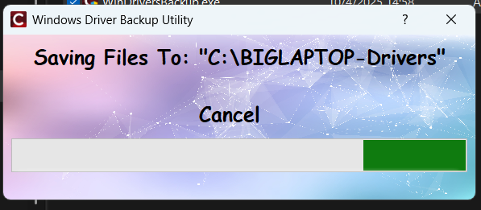
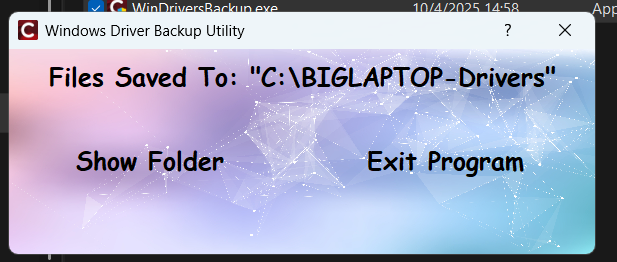
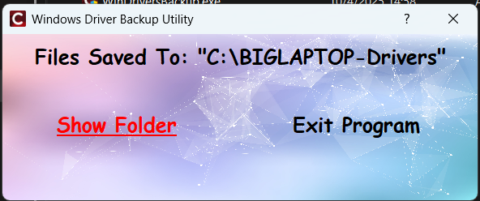
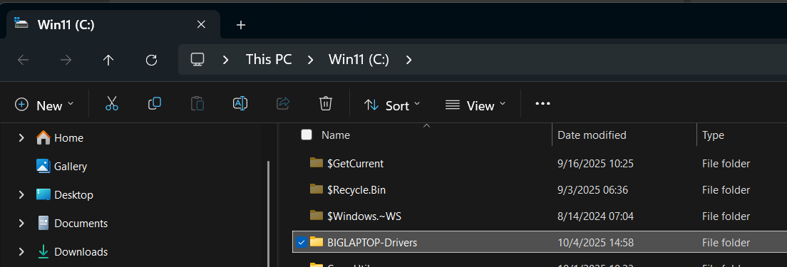
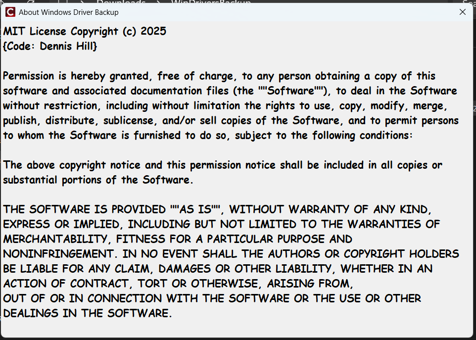

# WinDriversBackup

A Windows utility to export and back up all installed drivers using DISM, with a simple VCL GUI.

## Features

- Exports all drivers from your system using DISM
- Simple, user-friendly interface
- Progress bar and status updates
- Option to open the export folder after completion

## Installation

1. Download the latest release from [Releases](https://github.com/yourusername/WinDriversBackup/releases).
2. Extract and run `WinDriversBackup.exe`.

## Usage

1. Run the application, the program will request elevation as Administrator.
2. The app will automatically detect your computer name and set the export folder.
3. Click **Cancel** to stop the process at any time.
4. When finished, click **Show Folder** to open the export location.

## Build Instructions

- Requires Embarcadero C++Builder 12.1 CE or later.
- Open `WinDriversBackup.cbproj` in C++Builder.
- Select the **Release** configuration.
- Build the project.

## License

This project is licensed under the MIT License. See [LICENSE](MITLicense.png) for details.

## Contact

Created by [Dennis Hill](mailto:dennis@DiscoveringElectronics.com).

## Screenshots

